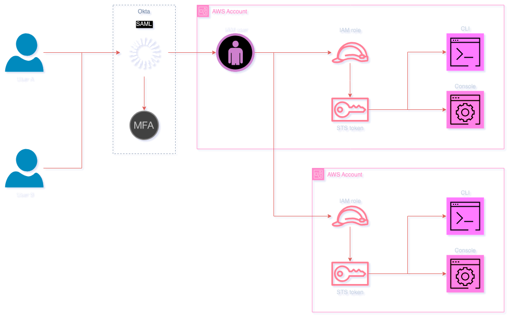

# Getting started with AWS - the proper way - no more IAM users

While many **[Amazon Web Services (AWS)](https://aws.amazon.com/)** tutorials still introduce [IAM](https://aws.amazon.com/iam/) users for accessing APIs and resources, this method is outdated and often inadequate for real-world applications due to hidden complexities that can arise as you scale, and security weaknesses.

Instead of using **IAM Users**, it's better to use **IAM Roles**, even for training purposes on your personal accounts and projects, to get used to the concept that will accompany you in your professional career as well. Even third-party services have begun to use IAM roles from their accounts instead of creating IAM users in yours to access your infrastructure. Here, we'll explore how to set up **[Single Sign-On (SSO)](https://wiki.oasis-open.org/security)** for AWS using **[Security Assertion Markup Language (SAML)](https://wiki.oasis-open.org/security)** with an **[Identity Provider (IdP)](https://en.wikipedia.org/wiki/Identity_provider)**, emphasizing why this is the essential skill you'll need everywhere now.

IAM role delegation through SSO provides a more streamlined, secure, and efficient way to grant access to resources. It eliminates the need to manage individual IAM users’ credentials, reducing administrative overhead and enhancing overall security. With SSO, users authenticate through a single set of credentials, simplifying their access to various services without needing multiple passwords. This approach also enables organizations to enforce stronger security practices like **[Multi-factor authentication (MFA)](https://en.wikipedia.org/wiki/Multi-factor_authentication)** consistently across all services. Additionally, it offers better compliance management by centralizing identity and access controls. And it's the most common way of accessing AWS APIs in the real world.

Therefore, you should start with a proper way of accessing AWS - with IAM roles delegation via SSO. This article will provide step-by-step instructions on how to set it all up for the first time. There are multiple ways of using SSO, but some of them generate costs or are too complicated to start with, e.g. **[AWS IAM Identity Center](https://aws.amazon.com/iam/identity-center/)** with **[System for Cross-domain Identity Management (SCIM)](https://simplecloud.info/)**. This example will concentrate on a free solution using **[Okta](https://www.okta.com/)** as IdP with SAML, being a leading standard in many companies. A robust free offering from Okta facilitates broader application across various services and systems. 

It is also beneficial to start early with AWS Organizations and to use multiple accounts, even for training purposes. As you get ready to discover essential skills about splitting workloads, cross-account access and permissions, etc.


## The old-school way

AWS access can be managed by creating IAM users with specific permissions and distributing access keys to team members. 

This method has several drawbacks:
* **Credential Management**: Managing multiple IAM users and their credentials is cumbersome, prone to errors, and not scalable.
* **Security Risks**: IAM users with long-lived access keys pose security risks if compromised.  
* **Limited Visibility**: Tracking user access and permissions across multiple accounts is challenging.
* **Compliance Challenges**: Meeting compliance requirements for access control is complex and time-consuming.
* **Lack of Centralized Control**: Each AWS account has its own user management, leading to siloed access control.
* **Complicated Multi-Factor Authentication (MFA)**: Enforcing MFA for all users is not straightforward with IAM users.
* **No Single Sign-On (SSO)**: Users have to manage multiple credentials for different services.
* **No Federated Access**: Integrating with external identity providers is not seamless.
* **No Role-Based Access Control**: Defining granular permissions based on roles is limited.
* **No Automated User Provisioning**: Onboarding and off-boarding users is manual and error-prone.


## How it's done now

To address the limitations of traditional IAM user management, modern cloud environments are adopting SSO solutions with IdPs like Okta. 

Here's how SSO access improves the security and efficiency of your cloud environment:
* **Centralized User Management**: Manage user access to AWS centrally from the IdP system, eliminating the need for individual IAM users.
* **Enhanced Security**: Secure access to AWS resources with SAML-based authentication and MFA through IdP reduces the risk of compromised credentials.
* **Compliance and Auditing**: Easily track user access to AWS resources and their authentication methods through IdP's comprehensive logs.
* **Role-Based Access Control (RBAC)**: Define granular permissions based on roles in AWS.
* **Session Management**: Control session duration so that even leaked credentials are invalidated quickly.
* **Automated User Provisioning**: Automate user onboarding and off-boarding with IdP's user lifecycle management.
* **Centralized Audit Trail**: Track user activities and changes across AWS accounts through audit logs.
* **Cross-Account Access**: Enable access across multiple AWS accounts with federated access.
* **User Self-Service**: Allow users to manage their access, reset passwords, or MFA settings through the IdP portal.
* **Simplified Access**: Users can access multiple services with a single set of credentials through SSO.




## How the login process looks like

The login process with AWS SSO using SAML involves the following steps:
1. **User Authentication**: Users log in to the IdP (e.g., Okta) portal with their credentials.
2. **SSO Authentication**: The IdP authenticates the user and generates a SAML assertion.
3. **SAML Assertion**: The IdP sends the SAML assertion to AWS SSO, requesting temporary credentials.
4. **Role-Based Access**: AWS validates trust policy of requested IAM role for IdP's IAM user and SAML assertion by providing temporary credentials.
5. **Access to AWS Resources**: Users can access AWS resources using those credentials provided by AWS.
6. **Session Management**: AWS manages the session duration and automatically invalidates the temporary credentials after the session expires.


## Step-by-step guide to setting up AWS SAML access with Okta

### Prerequisites

- Running a Unix-like operating system (e.g. macOS or Linux).
- Basic understanding of AWS, especially IAM and [Organizations](https://docs.aws.amazon.com/organizations/latest/userguide/orgs_introduction.html).
- Some understanding of [Terraform](https://www.terraform.io/) and using modules.
- At least one [AWS](https://aws.amazon.com/) account.
- An [Okta](https://www.okta.com/) account.

This example solution will require the creation of an initial IAM user for Terraform to provision all the necessary resources. It can be deleted later when the SSO is fully set up.


### Guide

1. **Set up your Okta account**<br>
   A free account is enough for this purpose.
    - Create an Okta account if you don't have one.
    - Go to the Okta **Admin** dashboard.
    - Take note of the page URL, it should be similar to `https://dev-123456-admin.okta.com/admin/getting-started`, where `dev-123456` will be your organization name, and `okta.com` will be Okta’s base URL.

2. **Create an API token in Okta** - see a **[video recap](https://www.youtube.com/watch?v=PNmFd45F-Kg)**<br>
   Those credentials will be used by Terraform to interact with Okta, i.e. create groups, assign users to the groups, etc.
    - In the Okta **Admin** dashboard.
    - Navigate to **Security** > **API** and select the **Tokens** tab.
    - Click on **Create Token**.
    - Give the token a name and click **Create Token**.<br>
      
    - Copy the token value and store it securely.

3. **Create an IAM user in the AWS account** - see a **[video recap](https://www.youtube.com/watch?v=iydmmiI_Zug)**<br>
   This will be a temporary user for Terraform before you can switch to using roles. You may already have one created before if you've used Terraform or tried using AWS CLI. It may be reused for that purpose as well, just double-check permissions to IAM and Organizations.
    - Log in to your organization's master account, using for example root credentials.
    - Go to the **IAM** service.
    - Navigate to **Users** and click on **Create user**.
    - Enter a username, e.g. `terraform`, and click **Next**.
    - Select **Attach policies directly** and search for **IAMFullAccess** and **AWSOrganizationsReadOnlyAccess** in **Permissions policies**, select them, and click **Next**.
    - Confirm the next page by clicking **Create user**.<br>
      
    - When the list of users shows up click on the name you’ve provided to get user details.
    - Click on the **Security credentials** tab and find the **Create access key** button.
    - Select **Command Line Interface (CLI)**, check the box on the bottom, and click **Next**.<br>
      
    - Confirm by clicking the **Create access key**.
    - Store securely **Access key** and **Secret access key** (click on **Show**) values.
    - Take note of the account ID in the upper right corner.<br>
      

4. **Set up AWS CLI** - see a **[video recap](https://www.youtube.com/watch?v=QeY9GbUvOG0)**<br>
   Command Line Interface credentials are necessary for Terraform to interact with AWS.
    - Install [AWS CLI](https://docs.aws.amazon.com/cli/latest/userguide/getting-started-install.html) if you haven't already.
    - Create a configuration file in your home directory `~/.aws/config` with the following content:<br>
      ```
      [default]
      region = eu-west-1
      output = json
      ``` 
    - Create a credentials file in your home directory `~/.aws/credentials` with the following content:<br>
      ```
      [okta-master]
      aws_access_key_id = MyRaNdOmAcCeSsKeY
      aws_secret_access_key = MyRaNdOmSeCrEtKeY
      ```
      Enter the values from the IAM user you’ve created. That will become `okta-master` profile used later by Terraform.
    - Run `aws sts get-caller-identity --profile okta-master`, to make sure there are no errors and the account ID and username match the expected values.<br>
      It should give something like:
      ```json
      {
        "UserId": "SOMEOTHERVALUE",
        "Account": "123456789012",
        "Arn": "arn:aws:iam::123456789012:user/terraform"
      }
      ```

5. **Set up Terraform** - see a **[video recap](https://www.youtube.com/watch?v=2-ArlogiH7Y)**<br>
   Terraform will be used to provision all the necessary resources in AWS and Okta.
    - Download the provided module source code in a subdirectory of Terraform sources.<br>
      Keep in mind this module is only provided as-is for the demonstration of an idea, not as a full-proof production-ready solution.
    - AWS credentials will be taken by the provider from `~/.aws/credentials` file, so make sure they are set up correctly and profiles names match the ones used in the code.
    - Okta provider needs to have `OKTA_API_TOKEN` environment variable set with the token you’ve created before. <br> 
      The same value is also needed to passed as `okta_api_token` variable in Terraform code, to do it safely use `TF_VAR_okta_api_token` environment variable. <br>
      This variable is used by Terraform `http` provider to download IdP metadata from Okta on the fly, without the need of saving the file locally.
    - Create a new file, e.g. `terraform.tf` and add the following content to define providers:<br>
      ```hcl
      terraform {
        required_version = ">= 1.7.0"

        required_providers {
          aws = {
            source  = "hashicorp/aws"
            version = "~> 5.0"
          }

          http = {
            source  = "hashicorp/http"
            version = "~> 3.0"
          }

          okta = {
            source  = "okta/okta"
            version = "~> 4.0"
          }
        }
      }

      # https://registry.terraform.io/providers/hashicorp/aws/latest/docs
      provider "aws" {
        alias   = "master"
        profile = "okta-master"
        region  = "eu-west-1"
      }

      # https://registry.terraform.io/providers/okta/okta/latest/docs
      provider "okta" {
        org_name = "dev-123456"
        base_url = "okta.com"
      }
      ```
      Replace the values with your own, e.g. `dev-123456` with your organization name, define `aws` providers for master account.
    - Create a new file, e.g. `okta.tf` and add the following content to define access mapping for your AWS organization:<br>
      ```hcl
      locals {
        assignment = jsonencode({
          "first.user@example.com" = {
            "123456789012" = [
              "AdminAccess",
              "ReadOnlyAccess"
            ],
            "987654321098" = [
              "AdminAccess",
              "ReadOnlyAccess"
            ]
          },
          "second.user@example.com" = {
            "123456789012" = [
              "ReadOnlyAccess"
            ],
            "987654321098" = [
              "ReadOnlyAccess"
            ]
          }
        })
      }
      
      variable "okta_api_token" {
        description = "The Okta API token for downloading the IdP metadata"
        type        = string
        sensitive   = true
      }
      ```
        Replace the values with your own, e.g. emails and account IDs, and roles' names.<br>
        For every account and role defined, there will be a corresponding group created in Okta, and users assigned to those groups will have access to the roles.<br>
        Group names will be in the format `aws_<account_id>_<role_name>`.
    - To the same file add the following content to define the first module copy for the master account:<br>
      ```hcl
      module "master_account" {
        source = "../module-okta-saml-aws"

        providers = {
          aws  = aws.master
          okta = okta
          http = http
        }

        assignment     = local.assignment
        okta_api_token = var.okta_api_token
      }
      ```
      You can further adjust module configuration, e.g. by changing role names, changing session duration, etc. Only the master account is defined here, child accounts can be defined in the next steps.
    - Run `terraform init` and `terraform plan` in the main Terraform directory. Review the plan and compare it with the code to understand dependencies.

6. **Create resources for Okta** - see a **[video recap 1](https://www.youtube.com/watch?v=kHh9hZe9k-o) and [vide recap 2](https://www.youtube.com/watch?v=rnRPKtHZoGg)**<br>
   Terraform will create a preconfigured SAML application in Okta, together with groups used for assigning access and the IAM user for Okta to federate the access.
    - Run `terraform apply` to create AWS SAML application in Okta and required IAM resources in AWS by confirming with **yes**.
    - Go to the **Users** page in the **IAM** console page in **AWS**, and find the user created by Terraform. The default name, if not changed, is `OktaUserSSO`. 
    - Open it and create a set of access keys as in one of the previous steps. Those credentials will be used by Okta.

7. **Configure SAML application in Okta** - see a **[video recap](https://www.youtube.com/watch?v=gu_oJEhDJkc)**<br>
   Now Okta needs to get configuration to access your AWS organization.
    - To connect Okta with AWS go to **Admin** page in **Okta**. 
    - Open **Applications** and search for **Amazon Web Services**, which was created by Terraform. 
    - When opened go to the **Provisioning** tab and click on **Configure API Integration**.
    - Mark the checkbox that appeared, and enter access keys created previously for `OktaUserSSO`, and click **Test API Credentials**. And **Save** if there were no errors.<br>
      
    - Go back to the list of applications expand **More** on the right and click **Refresh Application Data**. This will let Okta access your AWS account(s) and read IAM roles in them.<br>
     **It should be done every time an account(s) or role(s) are added or removed from provisioning.**<br>
      
    - Now the defined users can access the AWS Console through Okta. They need to log in to Okta and select the **Amazon Web Services** application to be redirected to the AWS Console.<br>
      If user has more than one role assigned they will be asked to choose which one to use.<br>
      

8. **Set up non-master AWS accounts** - see a **[video recap](https://www.youtube.com/watch?v=yYJip4jyPoc)**<br>
   Okta will now need to have its cross-account IAM role in the child accounts to read the roles and federate the login process.<br>
   Repeat **steps 3-6** for every child account you want to have access to.
    - In the `~/.aws/credentials` enter a new profile for the child account, e.g. `okta-child` with access keys for the user created in the child account.
    - In the `terraform.tf` file add a new provider for the child account, e.g. `child`.
      ```hcl
      provider "aws" {
        alias   = "child"
        profile = "okta-child"
        region  = "eu-west-1"
      }
      ```
    - In the `okta.tf` file add a new module copy for the child account, e.g. `module "child_account"`, and set the same provider alias as just created in the `terraform.tf` file.
      ```hcl
      module "child_account" {
        source = "../module-okta-saml-aws"

        providers = {
          aws  = aws.child
          okta = okta
          http = http
        }

        assignment     = local.assignment
        okta_api_token = var.okta_api_token
      }
      ```
    - Adjust the `local.assignment` variable to include the new account and roles if it's not already there.
    - Run `terraform apply` to create the required IAM resources in AWS for the child account. <br>
      Note that the SAML application in Okta is shared between all accounts, so it will not be created again.
    - Open again the **Provisioning** tab in the **Amazon Web Services** application in **Okta** and add the new account ID to the list of accounts in the **Connected Accounts IDs (optional)** field.<br>
      Remember to add ID of the master account as well, if it's not there already. Divide them with a comma, e.g. `123456789012,987654321098`.<br>
      This will let Okta access the child accounts and read IAM roles in it.<br>
    - Refresh application data in Okta to read the roles in the child account.
    - Now the defined users can access the AWS Console in the child account through Okta.<br>
      

9. **Set up CLI for AWS** - see a **[video recap](https://www.youtube.com/watch?v=YK1p5GbNtj8)**<br>
   To fully migrate from IAM users to IAM roles you need to switch IAM credentials for your terminal and CLI tools. It can be done with various tools. For example Okta's [okta-aws-cli](https://github.com/okta/okta-aws-cli), but the author personally suggests Nike's [gimme-aws-creds](https://github.com/Nike-Inc/gimme-aws-creds), as the one being actively updated and improved, and can use hardware MFA in a headless mode. It can, for example, create a separate AWS credentials profile for every account and every IAM role your user has been assigned with. Which will help with running this example Terraform code, by just renaming credentials profiles names in AWS provider configuration.
    - Install **gimme-aws-creds**.
    - From **Amazon Web Services** application configuration in **Okta** admin dashboard open **General** tab and copy the URL under **App Embed Link**. It will be used as **app_url** next.
    - Create `~/.okta_aws_login_config` file with the following content, adjusted with your Okta organization details.
      ```
      [DEFAULT]
      okta_username = user.name@example.com
      cred_profile = acc-role
      aws_default_duration = 28800
      okta_org_url = https://dev-123456.okta.com
      app_url = https://dev-123456.okta.com/home/amazon_aws/0oaSoMeRanDoMh8/137
      preferred_mfa_type = token:software:totp
      gimme_creds_server = appurl
      write_aws_creds = True
      resolve_aws_alias = True
      remember_device = True
      output_format = json
      aws_rolename = all
      ```
    - Run `gimme-aws-creds`, it will update `~/.aws/credentials` creating needed profiles. The output of the command will tell which credentials profiles have been updated.
    - Use those profile names to configure AWS providers in your `terraform.tf` code replacing the previous ones.
      ```hcl
      provider "aws" {
        alias   = "master"
        profile = "my-org-master-AdminAccess"
        region  = "eu-west-1"
      }

      provider "aws" {
        alias   = "child"
        profile = "my-org-child-AdminAccess"
        region  = "eu-west-1"
      }
      ```
    - Run `terraform plan` to make sure no changes are needed and the new credentials work properly.
    - IAM users created for Terraform can now be deleted. Remember to deactivate access keys before deleting the user.


## Useful tips

  * Consider using a more scalable approach to **[Infrastructure as Code (IaC)](https://en.wikipedia.org/wiki/Infrastructure_as_code)**, different tools can make your life easier. Like **[Terragrunt](https://terragrunt.gruntwork.io/)**, which will automatically create cross-account access roles when creating new AWS accounts. This will eliminate the need to create IAM users in the child accounts within your organization.
  * Instead of access mapping in code you could use a more agile approach, for example with Okta push groups, which will allow you to build fully automated provisioning or self-service tools.
  * Consider [CI/CD](https://en.wikipedia.org/wiki/CI/CD) tools for running Terraform. Like [AWS CodeBuild](https://aws.amazon.com/codebuild/) and [AWS CodePipeline](https://aws.amazon.com/codepipeline/), which will use IAM roles instead of IAM users for provisioning resources.
  * Consider using [Role-Based Access Control (RBAC)](https://en.wikipedia.org/wiki/Role-based_access_control) in services that support it. For example, [Amazon Relational Database Services (RDS)](https://aws.amazon.com/rds/) databases can make use of those new roles you use to log into AWS.
  * Logging into the **Console** page of AWS while having a lot of accounts may be cumbersome, so consider our Brainly colleague’s Chrome plugin **[saml-searchbox](https://github.com/winglot/saml-searchbox)** to quickly search through accounts and roles.
  * Using Okta groups for assigning access is also similar to what **[AWS Identity Center](https://aws.amazon.com/iam/identity-center/)** would require, so you'll be familiar with the concept when you need to use it in the future.


## Moving Forward

* By following these steps, you've modernized how access is managed to your AWS resources, aligning with best practices for security and efficiency.<br> 
  It's essential to learn and adapt to these modern approaches, as this knowledge directly translates to real-world applications in cloud security and management.
* If you're a beginner in AWS, understanding IAM and the power of SSO integrations with services like Okta will set a strong foundation for your cloud computing journey.<br> 
  Keep exploring, learning, and applying these practices to ensure your cloud environments are secure, compliant, and efficiently managed.
* As you progress in your cloud career, you'll encounter more advanced scenarios and tools that build upon these foundational concepts.<br>
  Stay curious, keep learning, and adapt to the evolving cloud landscape to become a proficient cloud practitioner.<br>
  Embrace the challenges, seek out new knowledge, and apply best practices to build secure, scalable, and efficient cloud environments, even for training purposes.


## More information and meetup presentation

The source code for the module used in this article together with a meetup presentation with a demo run can be found on GitHub: [presentation-okta-saml-aws](https://github.com/ChristophShyper/presentation-okta-saml-aws)


